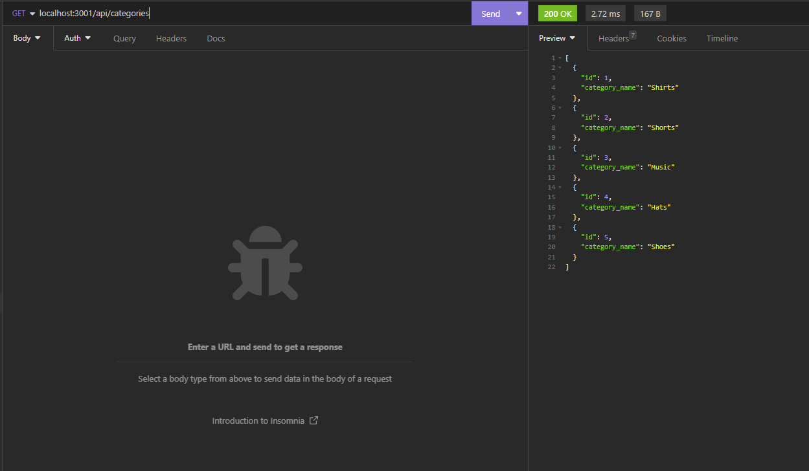
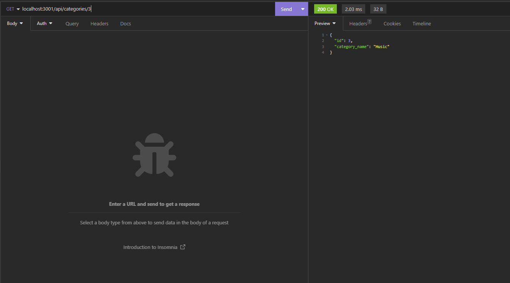
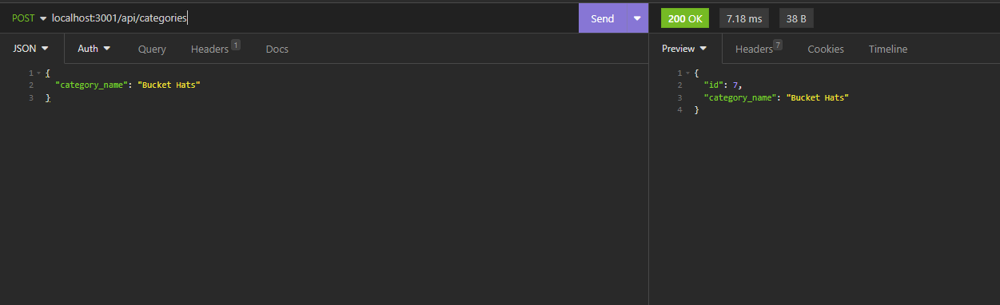
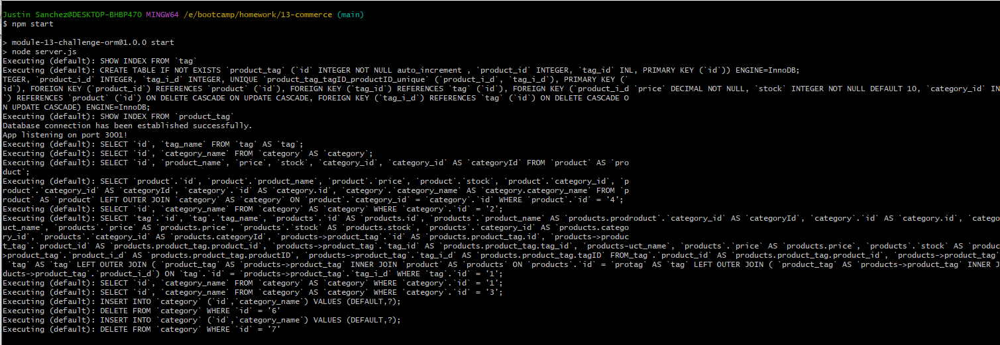

# ecommerce-backend

## Description
The objective of this project is to build the back end for an e-commerce site using Express.js API and Sequelize ORM to interact with a MySQL database. There are three groups called "Product", "Category", and "Tag". Each group should GET all items within the group, GET single item by ID, CREATE an item, UPDATE an item, and DELETE an item. 

## Technology Used
- Express.js
- Sequelize 
- Node.js
- MySQL

## Testing

GET all items in the categories group

GET single item by ID 

CREATE an item in category

Terminal showing the UPDATE, CREATE, and DELETE

## Live Demo
[Click Here](https://drive.google.com/file/d/1cB_kP63xmzBDiBdq7CFuuKf87L5BJInO/view)